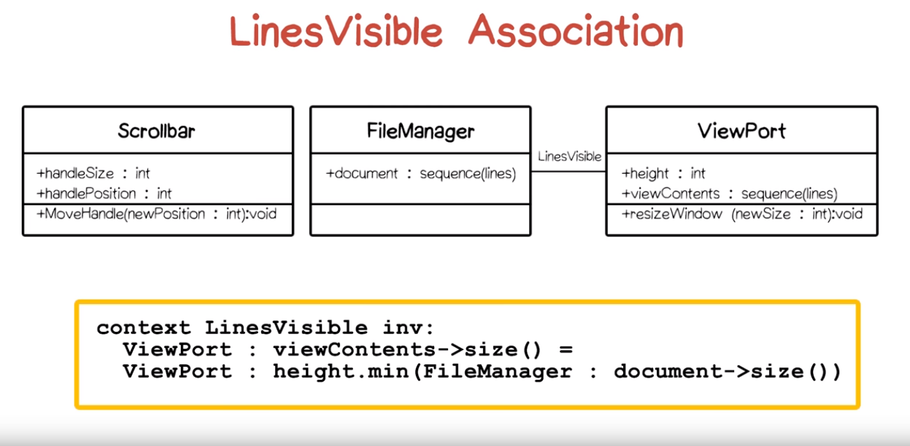
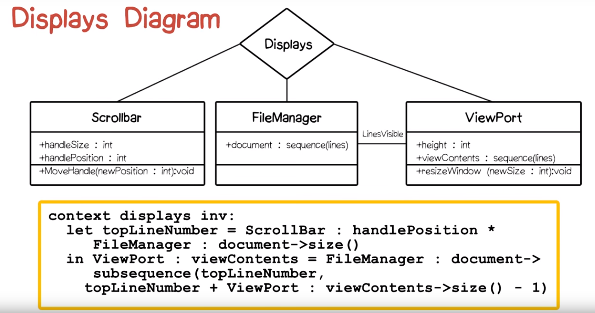

# P1L2 Text Browser Exercise (Analysis)

## Introduction
Design is better learned than taught. This video has students actively participate in an exercise where we design a text browser. 

## Text Browser Exercise
The problem space is a tool that allows browsing of text in a computer file, but there is no GUI (at all) to do this. The goal is to build a cleanly structured solution. 

## Quiz: GUI Elements Quiz
What are the bare minimum GUI elements required? 
- Window
- Scroll bar

## FileManager
The text is retrieved through a file manager component. Assume that:
- File contents cannot be held entirely in memory
- There will be line-oriented access to the file at the OS level
- Need a module that can treived a limited length, consecutive subsequence of the file's lines

## ViewPort
The window component is called a view port. Need it to display the contents. Use the following assumptions in order to simplify for the example's sake:
- Display the line numbers as an integer
- Show any number of lines between 1 and 100
- Text will be in the same font and font point size

## ScrollBar
The scroll bar is a way to supply numbers to other parts of an application. Will use a vertical scroll bar. There will be a moveable "handle" that can sit in a "tray." The user can set the position in the file by moving the handle in the tray. The handle's position indicates what text should be displayed. 

The size of the handle in proportion to the size of the tray indicates how much of the file is visible. For example, if the file is very small then a very large (or no handle) will be displayed. 

## Use Cases
How will the user use the application? This is called a "use case."

## Quiz: Use Cases Quiz
Open-ended quiz asking what use cases apply for the text browser application. Here are the one's I entered. 
- The user will open an exisiting file for reading only and browse through a text document. 
- A user might start a new document (create a document) and enter the very first text. 
- A user might open an existing document and edit what is there.

Professor's Examples:
- Basic view text is view text and read text
- Move the handle up and down during reading and editing
- Change viewport size

## Analysis Model
Once a handle on the major elements and behaviors (uses cases) has been obtained, an analysis model can be constructed. 

An analysis model will be specified in a UML class-model diagram. Rectangles define classes. Each rectangle is divided vertically into various areas:
- Component name goes at the top
- The middle area containts the attributes
- The bottom contains operations

Lines between rectangles define relationships between components.

## Quiz: Classes Quiz
This quiz covers the components. These component names would be:
- FileManager
- ViewPort
- ScrollBar

## Operations
Operations are those actions that the user can undertake to interact with the TextBrowser. 

We are concerned with an analysis _model_ and not a design, so we are not trying to fill in the implementation methods that are involved but instead we're using the class model diagram to define (at a high level) what the user can do. Examples in this case include (1) using the scroll bar and (2) resizing the view port.

## Quiz: Operations Quiz
UML uses a language agnostic approach to annotation, but it may use programming-language approaches. For example, it uses the "void" return type. 

UML is flexible. While conventionally the operations go in the bottom container, you can have any number of boxes.

There are some subtleties:
- The requirements didn't say only that the size of the viewport was an int. It also gave a range. UML doesn't have a way to express this. 
- The GUI toolkit will return some pixel position. However, since we're in the design stage we'll still assume we are working with a range. 

## Quiz: Visible Attributes Quiz
What the user can see (the GUI) is made of attributes called "percepts." Some examples of these that I came up with are:
- The window itself
- The scrollbar itself
- The tray itself
- Perhaps the mouse (although we aren't building that part)

Answers:
- Handle's position
- Size of the viewport
- Text itself
- Size of the handle (as it relates to how much of the document is being viewed)

## FileManager
We don't currently have a percept for the file manager (not visible to the user). It is helpful to view the OS as an external actor. The file manager will interact with the OS. 

The file manager has an attribute which is the document. The external actor, the OS, has to provide this document. 

## Relationships
Relationships is the harder part. There are three types of relationships:
- Associations
- Aggregations
- Generalizations

## Quiz: Relationships Quiz
What components are affected by the two user actions moveHandle and resizeViewPort? 

### moveHandle affects...
- ScrollBar
- ViewPort
- FileManager

### resizeViewPort affects...
- ViewPort
- ScrollBar
- FileManager

## Quiz: Number of Lines Quiz
The number of lines displayed would be the `minimum(numberOfLines, sizeOfWindow)` 
because we need to display based on the minimum of either of the ViewPort or the number of lines in the file. 

This cannot be described using UML. This would have to be defined using OCL. 

## LinesVisible Association
This relationship can be defined as a relationship (an _association_) between the FileManager and the ViewPort class. This will be discussed more later in the class. 

This association indicates there is a fact that must hold that the size of the viewports must be equal to the minimum of the size of the filemanager and the size of the viewport. 

## Quiz: Another Association Quiz
The answer is the position of the top position of the handle to the top position of the handle to the window size. Also described as:

`from topPositionOfHandle to (topPositionOfHandle + windowSize)`

## Explanation
There is a three-way relationship between all three components. This is called a ternary association (as opposed to binary).

## Displays Diagram
In UML a diamond is used to display this relationship. The OCL (the mathematical relationship) and the UML (class relationship) is shown in the image below: 

## Quiz: Handle Association Quiz
The handle essentially displays the percentage of the file size displayed. So, the answer would be: `numberOfLinesDisplayed / fileSize`

Note: this is also a ternary association. 

## HandleProportion

Note: it appears that OCL works as follows: 
- Start with the word "context" to indicate we are working with a contextual detail. 
- Name the context detail (scalesHandle in this case). 
- I am not clear what inv stands for. 
- In order, first display the class name and its individual attribute we are dealing with. Also, some attribute or feature of that former attribute can be displayed. Operations like division and arithmetic are supported. 

## Subtleties
Gotchas
- What if the length of the document is zero? We will get divide by zero?
- What do we "mean" by the size of the handle? We would have to translate this into a percentage. 
- What if we scrolled to the end of the file and we resize the window to make it bigger. What do we expect to see at the end? More lines that are blank or do we display the last line at the bottom? We have to make this decision ourself. 

Thinking through with modeling forces us to think through subtleties. 

Design is about solving the problems above. 