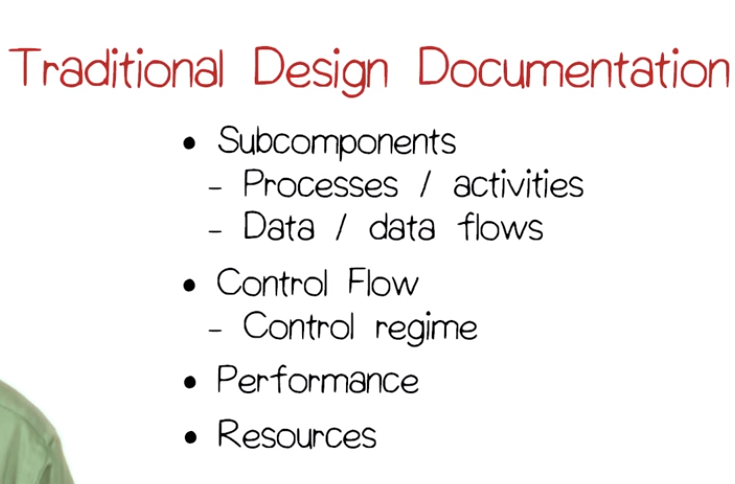
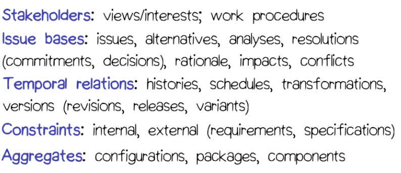

# Design Concepts

## Some Definitions
> Design: deliberate, purposive planning

> Engineering: Skillful or artful contrivance applying scientific and mathematical principles. 

> Craft: Skilled occupation

> Art: Use of skill, taste, and imagination in the production of aesthetic objects. 

## Software Design
Software design is the process of building  program while satisfying a problem's functional requirements and not violating its non-functional requirements. It's all about trade offs. 

There are two parts to software design: 
- Architectural design
- Detail design

Architectural design is the process of identifying and assigning the responsibility for aspects of behavior to various modules or components of software. 

Detail design is the process of specifying the behavior of each of the system components that you've identified during architectural design. 

## Approaches to Software Design
All design approaches have three things in common: the design method, the design notation, and how the design is validated. The design method simply acts as a _discipline_ and multiple design methods can be used. 

There are some issues with design methods. How will we start? With methods or user interaction? 

One important decision is the tradeoff between doing a design that saves time or focusing on the short term schedule. There are also questions around tools. 

Fixing design problems early is desirable. 

How do you validate a design? 
- Walkthrough and check a design with a team
- Tools

## Validation
Independent validators can help with the effectiveness of a design review. If the designers are the ones validating a design, they will likely miss issues that they overlooked while creating the design in the first place. Another issue that comes up is having a validation method that depends on the design method. A third issue is _when_ do you validate? You can do this as you go or wait until a major milestone.

## Other Design Issues
How do we deal with the emphasis on functional vs. non-functional design decisions? Also, how do we deal with the specification/what vs. the design/how? Finding the right boundary is important. Finally, what is specific to the application we are building that will impact design. 

## Design documentation
Large scale systems beg for good design documentation. Maintainers and developers are likely to be different. Different documentation is required depending on the type of application. This can vary between slides to formal notes. 

For example, a small research team wouldn't want to document heavily (formal documentation) because the documents would go out of date rapidly. 

## Traditional Design Documents
Traditional documents:

- IEEE 1.0.6 doc standard is a good reference. 
- Document the tradeoffs
- Document assumptions

Further detailed documents were devoped by the Leonardo Project:

Much of the above documentation covers what is called "design rationale" or _why did you do what did_. 

## Key Design Concepts for the Term
Conceptual Integrity: having a system that follows a single principle (and omits certain features) is better than having a system with more features but is built of many disparate design approaches. 

Coupling: the extent to which two components depend on each other for successful execution. Low coupling is good. For example, if you have to change one module, low coupling means not having to change other modules. 

Cohesion: the extent to which a component has a single purpose or function. High cohesion is good. 

